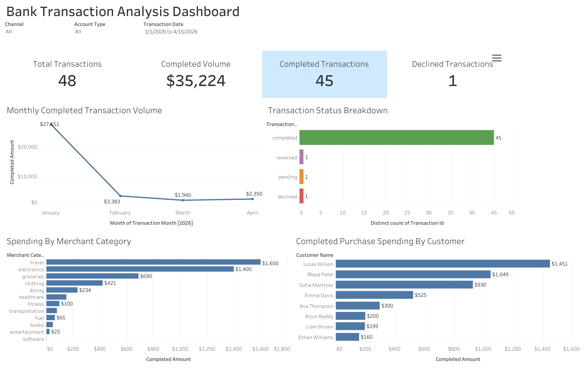

# Bank Transaction Analysis Database

## Project Overview

This project is a SQL-only banking analytics database built with PostgreSQL. It models customers, bank accounts, merchants, and financial transactions using a relational database structure.

The project demonstrates database design, data validation, joins, aggregate functions, common table expressions (CTEs), window functions, views, and indexes. It also answers practical business questions related to customer activity, transaction behavior, merchant performance, and account balances.

All customer and transaction records in this project are fictional and were created only for educational and portfolio purposes.


## Project Objectives

- Design a relational banking database with clearly connected tables.
- Protect data quality using primary keys, foreign keys, unique constraints, and check constraints.
- Load realistic fictional sample data for analysis.
- Answer business questions using basic and advanced SQL queries.
- Use CTEs and window functions for more complex analysis.
- Create reusable views for reporting.
- Add indexes to improve query performance.
- Prepare the database for connection to a visualization dashboard.

## Tools and Technologies

- PostgreSQL
- SQL
- `psql` command-line interface
- Git and GitHub
- Tableau Public (planned dashboard)

## Database Structure

The database contains four main tables:

| Table | Purpose |
|---|---|
| `customers` | Stores customer names, contact details, date of birth, and location. |
| `accounts` | Stores bank accounts, account types, balances, statuses, and ownership information. |
| `merchants` | Stores merchant names, business categories, locations, and active status. |
| `transactions` | Stores deposits, withdrawals, purchases, transfers, refunds, transaction statuses, channels, amounts, and resulting balances. |

## Table Relationships

- One customer can own multiple accounts.
- Each account belongs to one customer.
- One account can contain multiple transactions.
- Each transaction belongs to one account.
- A merchant can be connected to multiple transactions.
- The merchant is optional for transactions such as deposits, withdrawals, and transfers.

## Project Files

| File | Description |
|---|---|
| `sql/01_schema.sql` | Creates the customers, accounts, merchants, and transactions tables with their constraints and relationships. |
| `sql/02_sample_data.sql` | Inserts fictional customers, accounts, merchants, and transaction records. |
| `sql/03_analysis_queries.sql` | Contains analytical SQL queries that answer business and financial questions. |
| `sql/04_views_indexes.sql` | Creates reusable reporting views and performance indexes. |
| `sql/05_dashboard_view.sql` | Creates a transaction-level reporting view for Tableau dashboards. |
| `README.md` | Explains the project, setup process, database design, and analysis features. |
| `.gitignore` | Prevents unnecessary or sensitive local files from being uploaded to GitHub. |

The numbered SQL files should be executed in numerical order.


## How to Run the Project

### Prerequisites

Install PostgreSQL and make sure the PostgreSQL service is running. Run the following commands from the main project directory.

### Setup and Execution

```bash
# Create the database
createdb bank_transaction_analysis

# Create the tables
psql -v ON_ERROR_STOP=1 -d bank_transaction_analysis -f sql/01_schema.sql

# Insert the sample data
psql -v ON_ERROR_STOP=1 -d bank_transaction_analysis -f sql/02_sample_data.sql

# Run the analytical queries
psql -v ON_ERROR_STOP=1 -d bank_transaction_analysis -f sql/03_analysis_queries.sql

# Create the views and indexes
psql -v ON_ERROR_STOP=1 -d bank_transaction_analysis -f sql/04_views_indexes.sql

# Create the Tableau dashboard view
psql -v ON_ERROR_STOP=1 -d bank_transaction_analysis -f sql/05_dashboard_view.sql
```

The `ON_ERROR_STOP=1` option makes PostgreSQL stop immediately if an SQL file contains an error.

## SQL Skills Demonstrated

- Creating tables with appropriate PostgreSQL data types
- Defining primary-key and foreign-key relationships
- Using identity columns to generate unique IDs
- Applying `NOT NULL`, `UNIQUE`, `CHECK`, and `DEFAULT` constraints
- Using transactions with `BEGIN` and `COMMIT`
- Combining related tables with `INNER JOIN` and `LEFT JOIN`
- Summarizing data with `COUNT`, `SUM`, `AVG`, `MIN`, and `MAX`
- Grouping and filtering results with `GROUP BY` and `HAVING`
- Creating conditional categories with `CASE`
- Organizing complex queries with common table expressions (CTEs)
- Performing ranking and running calculations with window functions
- Creating reusable views for reporting
- Creating indexes to improve filtering, joining, and sorting performance

## Business Questions Explored

The analytical queries are designed to answer questions such as:

- How many accounts does each customer own?
- What is the total balance held by each customer?
- How many transactions were completed, failed, pending, or reversed?
- What is the total transaction value for each transaction type?
- Which transaction channels are used most frequently?
- Which customers have the highest transaction activity?
- Which merchants and merchant categories receive the most spending?
- How does transaction activity change over time?
- Which transactions are larger than the average transaction amount?
- How can customers, accounts, or merchants be ranked by financial activity?
- What is the running transaction total for each account?
- Which accounts have limited or no transaction activity?

## Views and Performance Optimization

The `04_views_indexes.sql` file contains reusable database views that simplify reporting queries. These views organize commonly joined or summarized information so that users do not need to rewrite the same complex SQL each time.

The file also contains indexes for columns frequently used in joins, filters, and date-based analysis. Indexes can improve query performance by helping PostgreSQL locate relevant rows without scanning an entire table.

Views improve query readability and reusability, while indexes improve data-retrieval performance. Indexes require additional storage and can slightly increase the time required for inserts and updates, so they should be created only when they support common query patterns.

## Data Integrity

The database protects data quality through:

- Primary keys that uniquely identify each record
- Foreign keys that maintain valid relationships between tables
- Unique constraints that prevent duplicate values
- Check constraints that restrict transaction types, statuses, account types, and channels
- `NOT NULL` constraints for required information
- Default values for statuses, timestamps, and balances
- Transactions that prevent partially completed data loads

## Project Limitations

- The dataset is fictional and relatively small.
- The project is intended for education and portfolio demonstration, not production banking use.
- Performance improvements from indexes may be difficult to measure with a small dataset.
- The project does not perform real fraud detection or make financial decisions.
- Account balances are provided as sample analytical data and are not maintained by a complete banking ledger system.

## Future Improvements

- Create an interactive Tableau dashboard
- Add more fictional transaction records for performance testing
- Add rule-based suspicious-transaction indicators
- Compare query performance using `EXPLAIN ANALYZE`
- Add monthly customer and merchant reporting views
- Add dashboard screenshots and analytical findings to the repository

## Interactive Tableau Dashboard

An interactive Tableau dashboard was created to explore transaction volume,
transaction statuses, merchant-category spending, and customer spending.

The dashboard includes filters for transaction date, channel, and account type.

[View the interactive Tableau dashboard] https://public.tableau.com/app/profile/sai.vineesh.pentyala/viz/Bank_Transaction_Analysis_Dashboard_twbx/BankTransactionAnalysisDashboard?publish=yes



## Author

Sai Vineesh Pentyala  
Computer Science Student, University of North Texas
